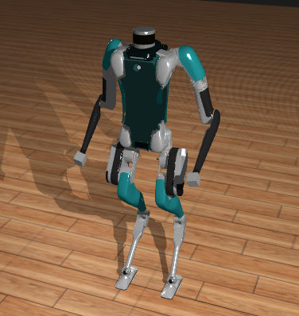

# DigitVisualizer.jl
Julia package for visualizing the Digit Humanoid Robot and exploring its kinematics.

<!--  -->

## Installation
1. Open your Julia REPL by typing  `julia` in your terminal.
2. Press `]` on your keyboard to enter the package manager
3. Enter command `add https://github.com/adubredu/MeshCatMechanisms.jl` and press `Enter` on your keyboard to install the MeshCatMechanisms dependency
4. Enter command `add https://github.com/adubredu/RigidBodyDynamics.jl` and press `Enter` on your keyboard to install the RigidBodyDynamics dependency
5. Enter command `add https://github.com/adubredu/DigitVisualizer.jl` and press `Enter` on your keyboard to install this package.
6. Press the `Backspace` key on your keyboard to return to the REPL

## Usage
See the [examples](examples) folder for usage examples.